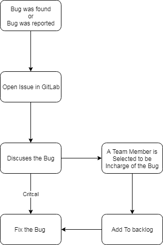
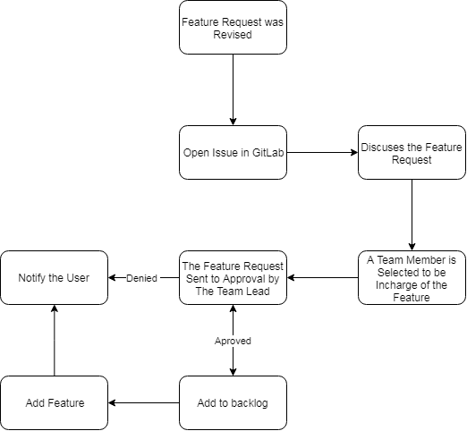
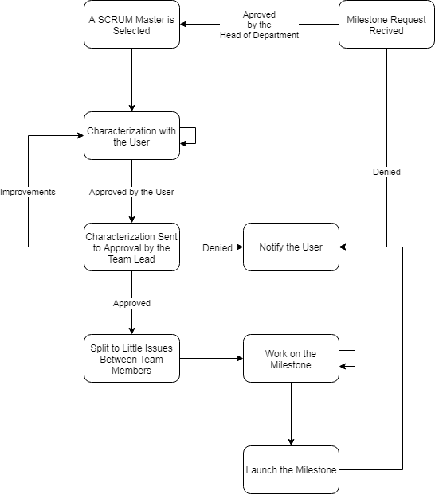
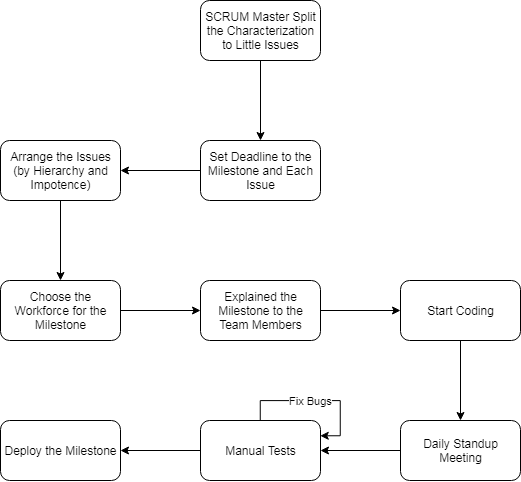
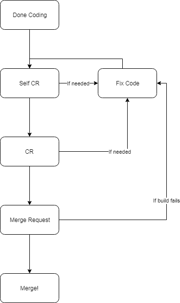
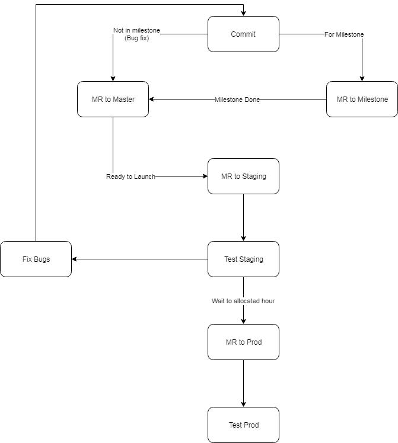

# Team's Omek Workflow

> Note: Feel free to challenge and update the workflow.

To prevent the team to act as headless chicken we established the following workflows:

* [Bug](#bug)
* [Feature Request](#feature-request)
* [Milestone](#milestone)
* [Commit](#commit)
* [Git](#git)

## Bug

A software bug is an error, flaw, failure or fault in a computer program or system that causes it to produce an incorrect or unexpected result, or to behave in unintended ways.

We try to minimize the bugs in our systems by adding automated test, doing CR and Merge request and (sometimes) manual tests. If a user or a team member encounter a bug we need to follow to following workflow:

## Feature Request

As an active system we receive allot of feature requests from the users and even our self. Most of the time the feature requests isn't part of the road-map of the team. Follow the following workflow:

## Milestone

Milestone or as called in the Agile methodology, a "Sprint" is a group of little issues that have a strict deadline. In every milestone there should be a SCRUM master that manages the issues, split the workforce, mange the standup meetings and always know what the status of the milestone.

To run (is the management side) milestone we need to follow the following workflow:

In the development side, follow the following workflow:

## Commit

To commit changes in code we need to follow a basic set of steps:

## Git

To commit changes you need to follow the [Commit Message Guidelines](CONTRIBUTING.md#commit) and this workflow:

